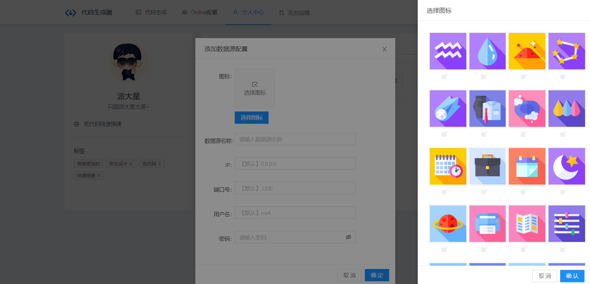

  

 <h2 align="center">低代码生成器</h2>
 
支持可视化配置数据源、在线创建数据库表结构、指定代码生成路径

<h2>项目演示</h2>

<h2>项目简介</h2>
项目目录展现：

|  子项目   | 描述  | 目录地址 | 
|  ----  | ----  | ---- |
| <a href="https://github.com/pdxjie/low-code/tree/master/low-code-home">🛸低代码生成器前端视图</a>  | 可视化配置数据源以及代码生成主页 | <a href="https://github.com/pdxjie/low-code/tree/master/low-code-home">low-code-home</a>
| <a href="https://github.com/pdxjie/low-code/tree/master/low-code-tools">🛰️低代码生成器后端服务</a>  | 代码生成业务逻辑 | <a href="https://github.com/pdxjie/low-code/tree/master/low-code-tools">low-code-tools</a>

低代码生成器问世的目的是为了解决项目初期为搭建基础架构时的繁琐而开发出的网站，以 <strong>" 帮助大家更快的开发出后端服务，提高开发效率 "</strong> 为目标的一种解决方案。

<h2>项目特色</h2>

- 数据源可视化配置
- 在线Online创建数据库表结构
- 平台主题风格、导航模式、自由选择
- 自定义代码本地生成路径、项目名称、项目包名层级结构
- 默认支持生成代码驼峰命名、以及自定义需要去除的表名前缀（sys_,custom_）
- 项目框架是基于目前最流行的SpringBoot技术，并且包含MyBatis、MyBatis-Plus两种ORM持久层框架可供选择

> 🪐 用合适的技术，写出最优质的代码 🪐

<h2>平台背景</h2>
在实习过程中，总是避免不了被分配到一些基础的增删改查接口的编写任务，往往这种任务是最没有价值，且非常耗费时间的一件事情，
不过好在现在也是有很多优秀逆向工程插件以及想Mybatis-Plus这样优秀的ORM框架可以帮助我们来完成这项工作，但是每次使用时都要进行
或多或少的配置，在重复进行类似的工作后，不由得让我陷入沉思。
 
 
在完成老师布置的课设任务时，亦是如此，学校中的课设任务往往是一些简单的增删改查接口的实现，即使简单，可是对于基础薄弱的同学来说
也是一种挑战。
 
 
在意识到这些问题后，作为一个开发人员，我可以做些什么呢？这些问题无疑是真是存在的，但是又当如何解决或者说如何去降低这类任务的实践
难度，于是带着这些问题和想法，经过一段时间的煎熬，终于完成了低代码生成器的第一个版本，也同样欢迎大家来体验平台的操作过程，如遇到问题，
还希望大家向我提出issues，并且项目也是全部开源，可供大家学习使用！觉得不错的同学，求个star，分享给自己身边的朋友吧！

<h2>项目展示</h2>

- <a href="https://github.com/pdxjie/low-code">低代码生成器——代码生成页面</a>

- <a href="https://github.com/pdxjie/low-code">低代码生成器——Online配置页面</a>

- <a href="https://github.com/pdxjie/low-code">低代码生成器——个人中心页面</a>

- <a href="https://github.com/pdxjie/low-code">低代码生成器——新增数据源配置页面</a>

